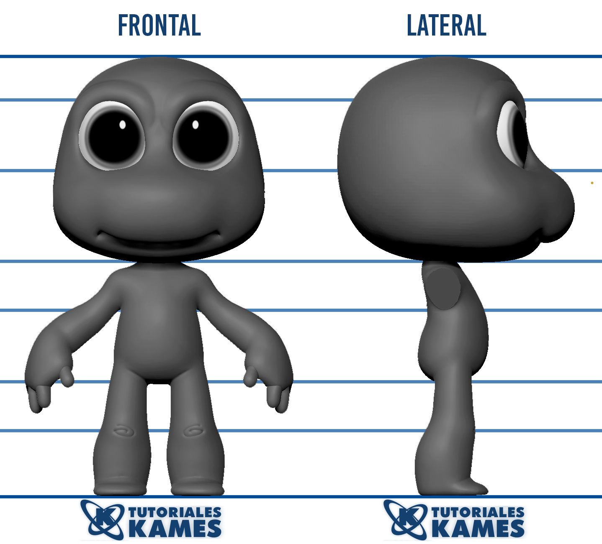

# Réplica del tutorial KAMES

## Inserción de imagen en Zbrush 
En esta sección insertaremos la imágen de la tortuga.
<center>

<br/>Imagen que se va a trabajar
</center>

 ```
    La clase de imágenes que se recomienda mejor trabajar es *Model Sheet*  
```
Las siguientes páginas proporcionan Model sheet: 
+ [imgbin.com](https://imgbin.com/)
+ [deviantart.com](https://www.deviantart.com/)
+ [www.artstation.com](https://www.artstation.com/)
+ [pixune.com](https://pixune.com/)